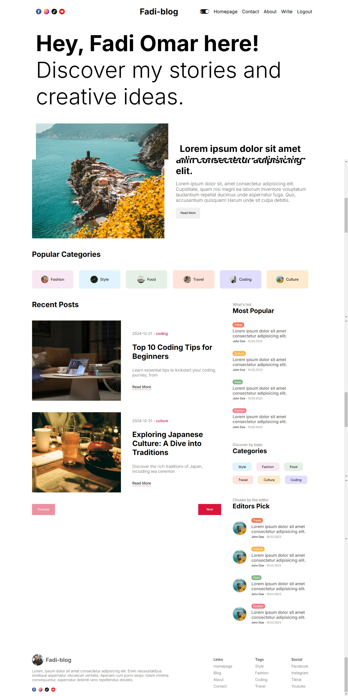
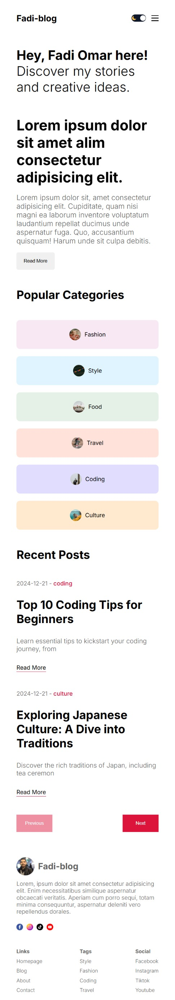
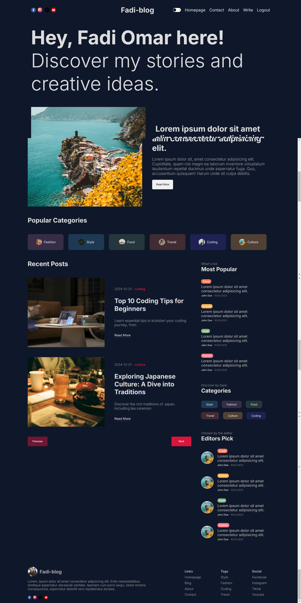

# 🎉 My Latest Project: A Feature-Packed Web Application 🚀

Welcome to the repository for my latest web application! This project is a culmination of modern technologies, thoughtful design, and a strong focus on creating a seamless user experience. Let me walk you through the details! 🌟

---

## **Technologies Used**

### 🌐 **Next.js**

I leveraged the power of Next.js for server-side rendering, static site generation, and API routes. This makes the app super fast, SEO-friendly, and flexible for future enhancements. It’s a joy to work with Next.js because of its developer-friendly ecosystem and scalability.

### 🔐 **NextAuth**

Implemented a secure authentication system with **Google Auth** and **GitHub Auth**. These options allow users to log in conveniently with their favorite accounts. Managing sessions and multiple providers was seamless, thanks to NextAuth’s well-documented API.

### 🔥 **Firebase**

Firebase was used for backend services like user session persistence, data handling, and even some real-time updates. Its powerful capabilities helped streamline the app without the need for a dedicated backend server.

### 🗄️ **MongoDB**

For the database, I chose MongoDB for its flexibility and ease of integration. Combined with Prisma, it allowed me to handle database queries and CRUD operations efficiently.

### 📜 **React Quill**

The app features a rich text editor powered by React Quill, enabling users to create and format content with ease. It’s user-friendly, intuitive, and integrates beautifully with the rest of the app.

### 🎨 **Prisma**

Prisma serves as my ORM, making database interactions smooth and type-safe. It simplifies complex queries and ensures the codebase remains clean and maintainable.

### 🎨 **CSS Styling**

I designed responsive layouts and modern UI components with clean and efficient CSS. The application supports **light mode**, enhancing the user experience while maintaining a visually appealing design.

### 📱 **Mobile-Friendly Design**

With a mobile-first approach, the app is optimized to look and perform beautifully on devices of all screen sizes. Every feature was tested for responsiveness and usability.

---

## **Features Highlights**

✅ Secure authentication with popular providers (**Google** & **GitHub**)

✅ Responsive and aesthetic layouts with clean CSS design

✅ A powerful rich text editor for dynamic content creation

✅ Real-time capabilities with Firebase for better user interaction

✅ Mobile-friendly and fast-loading pages thanks to Next.js

✅ Light mode for a user-friendly browsing experience

---

## **How to Run the Project Locally**

Follow these steps to get the project up and running on your local machine:

1. **Clone the repository:**

   ```bash
   git clone https://github.com/your-repo-name.git
   cd your-repo-name
   ```

2. **Install dependencies:**

   ```bash
   npm install
   ```

3. **Set up environment variables:**
   Create a `.env.local` file in the root of your project and add the following:

   ```env
   NEXTAUTH_URL=http://localhost:3000
   GOOGLE_CLIENT_ID=your-google-client-id
   GOOGLE_CLIENT_SECRET=your-google-client-secret
   GITHUB_CLIENT_ID=your-github-client-id
   GITHUB_CLIENT_SECRET=your-github-client-secret
   MONGODB_URI=your-mongodb-uri
   ```

4. **Run the development server:**

   ```bash
   npm run dev
   ```

5. Open [http://localhost:3000](http://localhost:3000) in your browser to view the app.

---

## **Looking for Your Feedback!**

I’m incredibly excited about this project and would love to hear your thoughts. Whether it’s feature suggestions, bug reports, or general feedback, your input is invaluable to me. Feel free to explore the app and share your thoughts!

👉 **[Try the app here!](#)**

Let’s connect and grow together as developers. Thank you for visiting my project’s repository! 💬

---

## **License**

This project is licensed under the [MIT License](LICENSE).

## **Images from the App**




